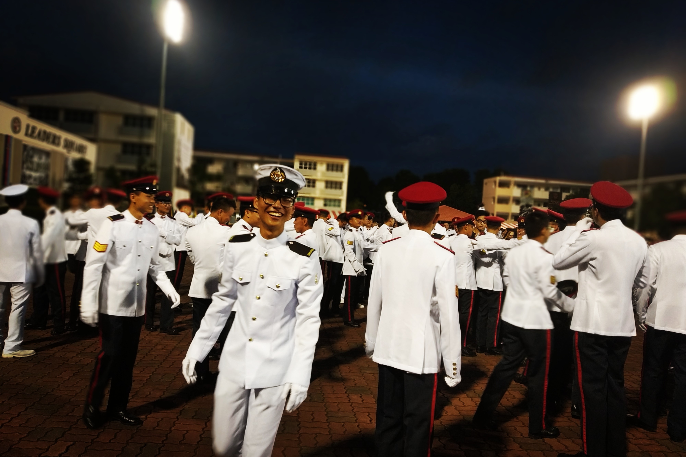

<!--  -->

### Welcome!

Hello! I'm Jeng — a Master's student studying at [Singapore Management University](https://www.smu.edu.sg/) in Quantitative Finance. I have my aspirations set on being a quant, and I have so much more to learn. This place will be my Great Library of Alexandria, where I store the many thoughts and invaluable knowledge throughout my journey.

Currently, I'm exploring these areas:

- Artificial intelligence (machine learning & neural networks) in finance.
- Research and development of trading strategies in financial markets.

### Hobbies & Interests

I love sports and video games. You can bet on finding me in one of these activities during my free time. I play squash competitively in Singapore's [National Squash League](https://sgsquash.com/national-squash-league/) and am a casual high-rank player (Top 0.01% in South East Asia) in [Dota 2](https://www.dota2.com/). Other sports and games include badminton, table tennis, cycling, League of Legends, Counter Strike and more!



p.s. If you're wondering why I've added art pieces to my posts — I like 'em :)

<!--  -->

<!-- <figcaption>Graduating as a Naval Military Police Specialist</figcaption> -->
